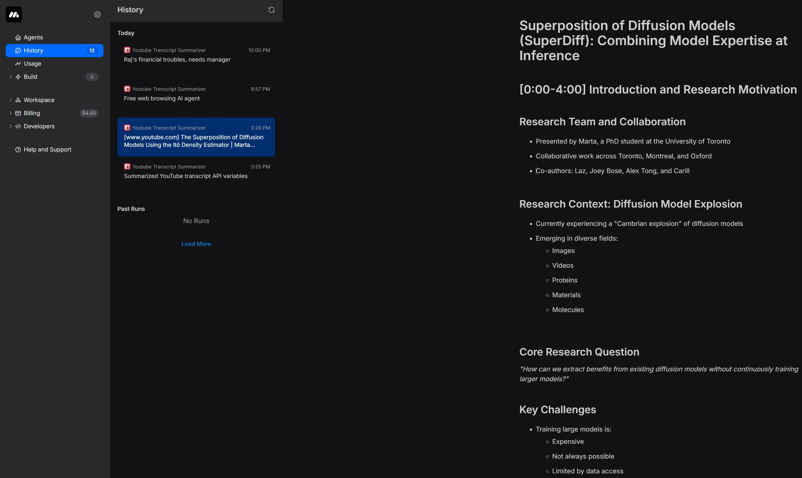

<!-- Image courtesy of MindStudio -->


# YouTube Video Summarizer using MindStudio

This project is a YouTube video summarizer built using [MindStudio]([https://mindstudio.example.com](https://www.mindstudio.ai/)). It processes YouTube videos and generates concise summaries.

## Features

- Converts YouTube video content into text summaries
- Uses MindStudio for processing and natural language understanding

## Repo Structure

```
project-root/
├── images/
|   ├── usage.jpg          # Screenshot of the summarizer in action
│   ├── workflow.jpg       # Diagram of the process workflow
│   ├── working1.jpg       # Screenshot of the summarizer in action
│   └── working2.jpg       # Another screenshot showing output/results
├── .gitignore             # Git ignore file
├── LICENSE
└── README.md              # Project documentation
```

## Demonstration Screenshots

Below are screenshots showcasing the working of the YouTube Video Summarizer:


*The summarizer processes a YouTube video and begins generating a summary.*


*The final summary output is displayed once processing is complete.*
