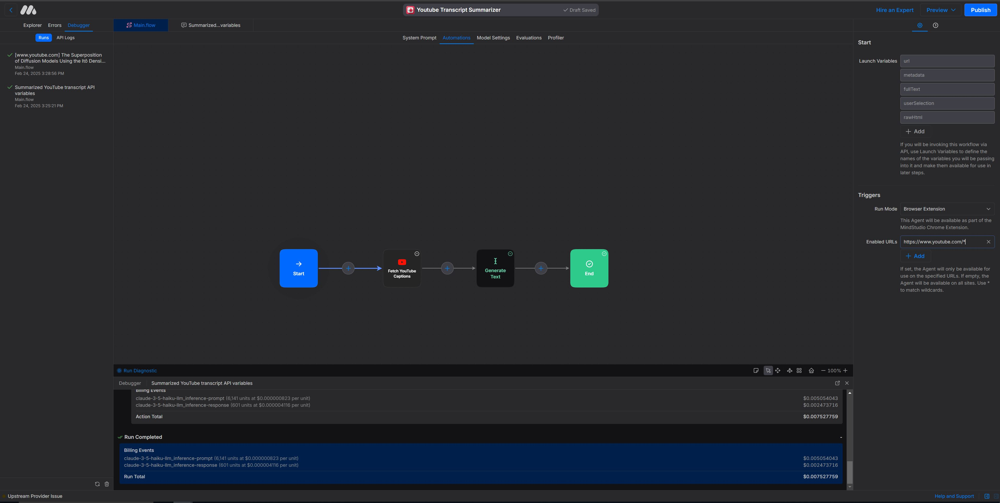
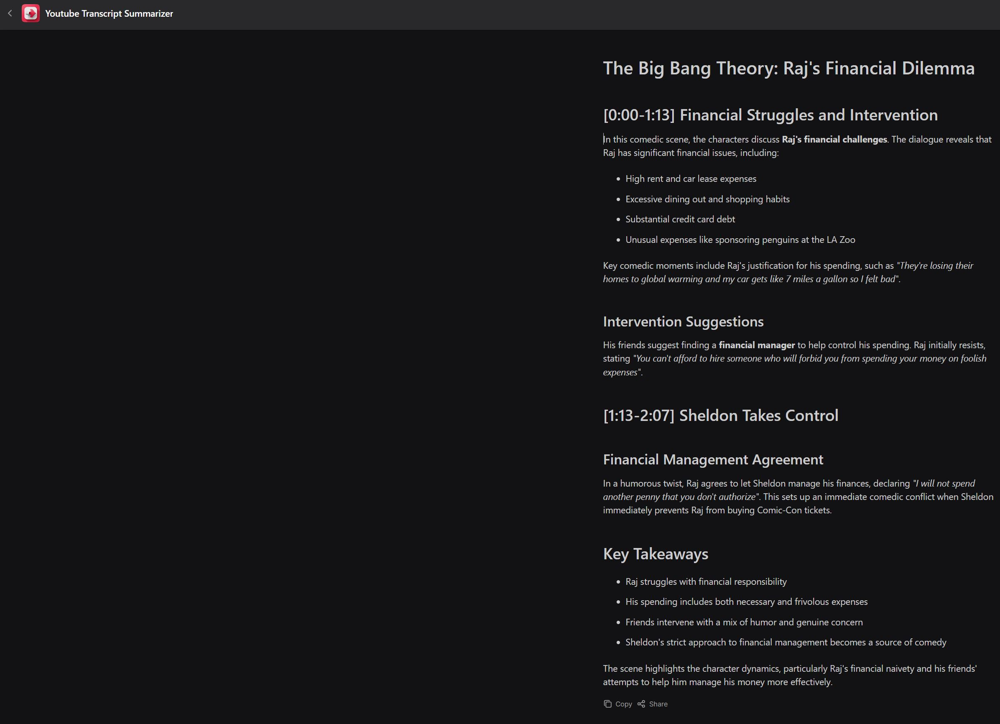

<!-- Image courtesy of MindStudio -->


# YouTube Video Summarizer using MindStudio

This project is a YouTube video summarizer built using [MindStudio]([https://mindstudio.example.com](https://www.mindstudio.ai/)). It processes YouTube videos and generates concise summaries.

## Features

- Converts YouTube video content into text summaries
- Uses MindStudio for processing and natural language understanding

## Repo Structure

```
project-root/
├── images/
|   ├── usage.jpg          # Screenshot of the summarizer in action
│   ├── workflow.jpg       # Diagram of the process workflow
│   ├── working1.jpg       # Screenshot of the summarizer in action
│   └── working2.jpg       # Another screenshot showing output/results
├── .gitignore             # Git ignore file
├── LICENSE
└── README.md              # Project documentation
```
## Workflow

This project leverages a streamlined four-step workflow in MindStudio:

1. **Start**: The process is initiated with the required input data.
2. **Fetch YouTube Captions**: Captions are automatically retrieved from the designated YouTube video.
3. **Generate Text**: The fetched captions are processed to produce the final text output.
4. **End**: The workflow concludes once the text is ready for use.



## Demonstration Screenshots

Below are screenshots showcasing the working of the YouTube Video Summarizer: <br><br>


<br>

